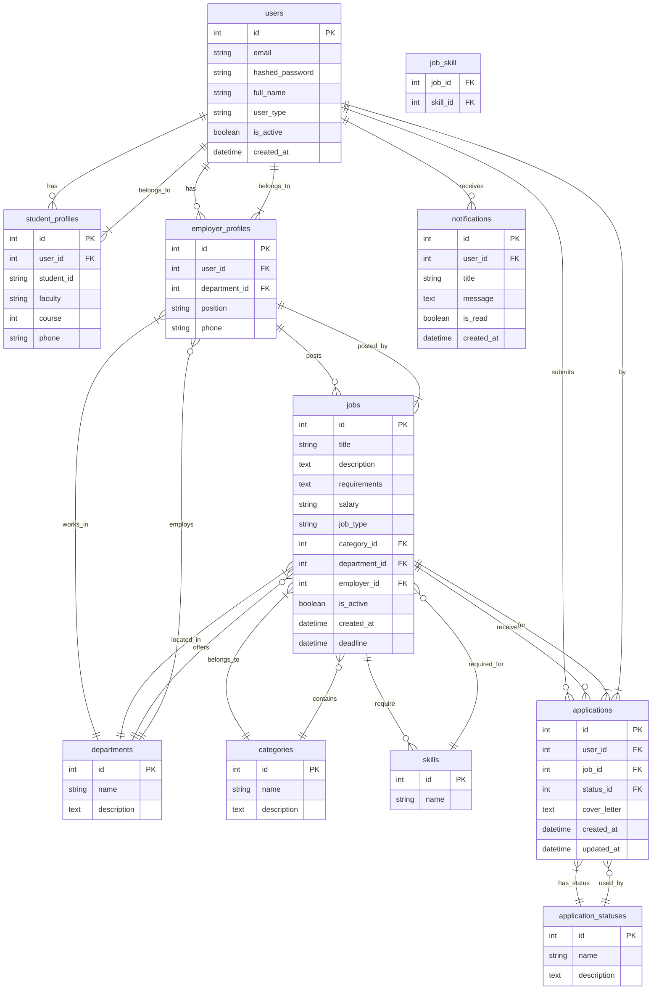

# Диаграмма базы данных Campus Jobs

```mermaid
erDiagram
    users {
        int id PK
        string email
        string hashed_password
        string full_name
        string user_type
        boolean is_active
        datetime created_at
    }
    
    student_profiles {
        int id PK
        int user_id FK
        string student_id
        string faculty
        int course
        string phone
    }
    
    employer_profiles {
        int id PK
        int user_id FK
        int department_id FK
        string position
        string phone
    }
    
    departments {
        int id PK
        string name
        text description
    }
    
    jobs {
        int id PK
        string title
        text description
        text requirements
        string salary
        string job_type
        int category_id FK
        int department_id FK
        int employer_id FK
        boolean is_active
        datetime created_at
        datetime deadline
    }
    
    categories {
        int id PK
        string name
        text description
    }
    
    skills {
        int id PK
        string name
    }
    
    applications {
        int id PK
        int user_id FK
        int job_id FK
        int status_id FK
        text cover_letter
        datetime created_at
        datetime updated_at
    }
    
    application_statuses {
        int id PK
        string name
        text description
    }
    
    notifications {
        int id PK
        int user_id FK
        string title
        text message
        boolean is_read
        datetime created_at
    }
    
    job_skill {
        int job_id FK
        int skill_id FK
    }
    
    users ||--o{ student_profiles : has
    users ||--o{ employer_profiles : has
    users ||--o{ applications : submits
    users ||--o{ notifications : receives
    
    student_profiles }|--|| users : belongs_to
    employer_profiles }|--|| users : belongs_to
    employer_profiles ||--o{ jobs : posts
    employer_profiles }|--|| departments : works_in
    
    departments ||--o{ jobs : offers
    departments ||--o{ employer_profiles : employs
    
    jobs }|--|| categories : belongs_to
    jobs }|--|| departments : located_in
    jobs }|--|| employer_profiles : posted_by
    jobs ||--o{ applications : receives
    
    categories ||--o{ jobs : contains
    
    skills ||--o{ jobs : required_for
    jobs ||--o{ skills : require
    
    applications }|--|| jobs : for
    applications }|--|| users : by
    applications }|--|| application_statuses : has_status
    
    application_statuses ||--o{ applications : used_by
```